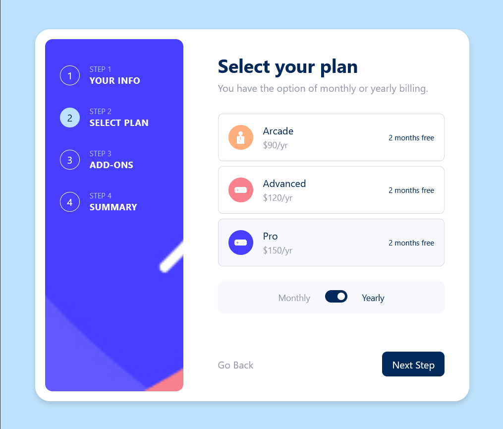
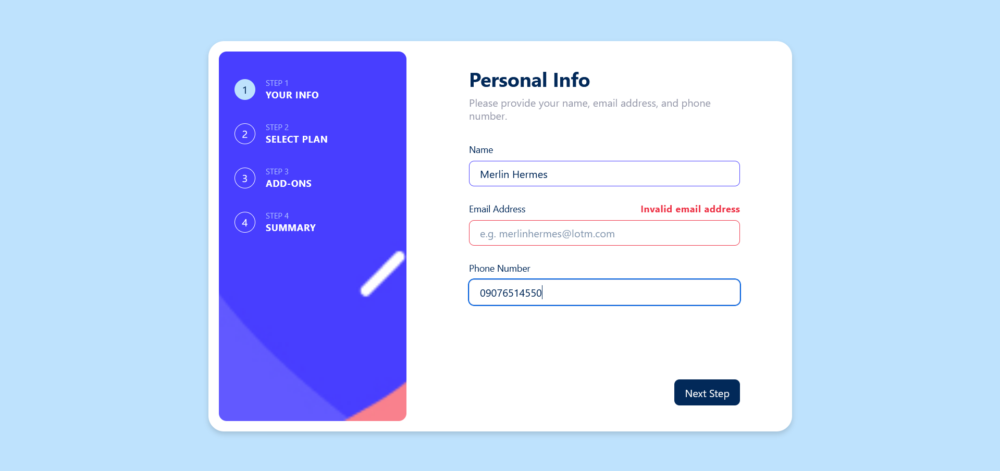
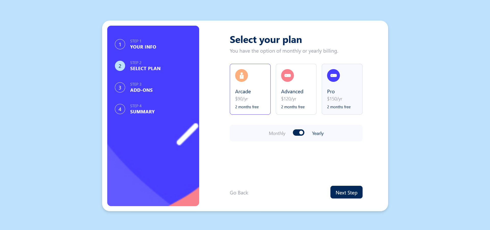
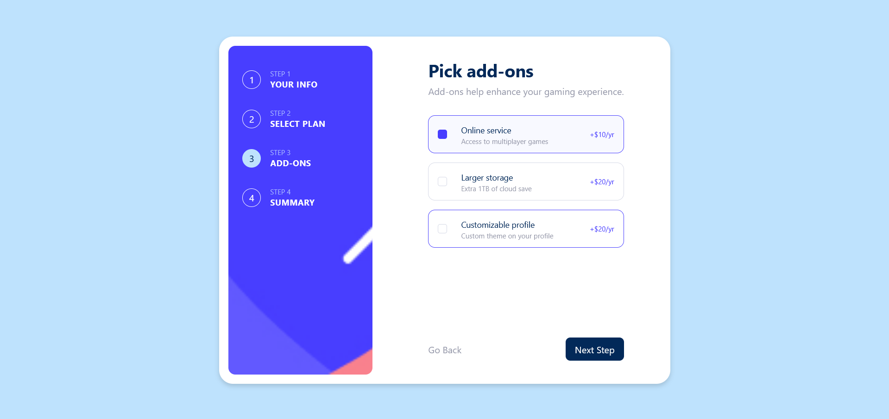
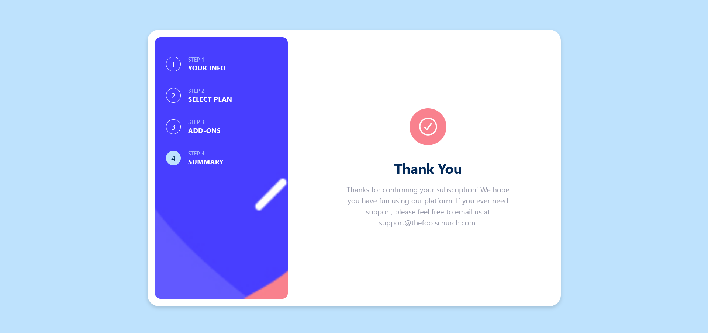

## Frontend Mentor

# Multi-step Form
A multi-step form with persistent data on submit, validation on change, links to each step, and responsiveness. 

### Features
- Data is saved to local storage on submit
- Form validation on change to avoid skipping steps through next button or sidebar link
- Responsiveness to different screen sizes

### Built With
- React + Vite
- React Hook Form
- React Router
- Tailwind CSS
- Radix UI
- Zustand

### Getting Started
In order to setup and work on this project on your own, you will need to:

Clone this project: 
`git clone https://github.com/nofuenterr/multi-step-form.git`

Once you have cloned this project, you can install the required dependencies by using: 
`npm install`

A live demo of the project can be started by using: 
`npm run preview`

Distribution files can be produced using: 
`npm run build`

### Credits/Acknowledgments
This project is for personal use only. I do not own any of the rights for the assets used in this project.

### Display
#### Phone

#### Tablet

#### Desktop: Info Page

#### Desktop: Plan Page

#### Desktop: Addons Page

#### Desktop: Summary Page

#### Desktop: Thank You Page

### To-do
- [ ] Add animations
- [ ] Add check icon to checkbox on Addons step
- [ ] Format Addons names on Summary step
- [ ] Save form data on change to survive on browser reload
- [ ] Improve error handling
- [ ] Add dark mode toggle

---

Developed by **RR Nofuente**
