# Multi-step Form

> A validated multi-step subscription form with persistent data, step links, and full responsiveness.

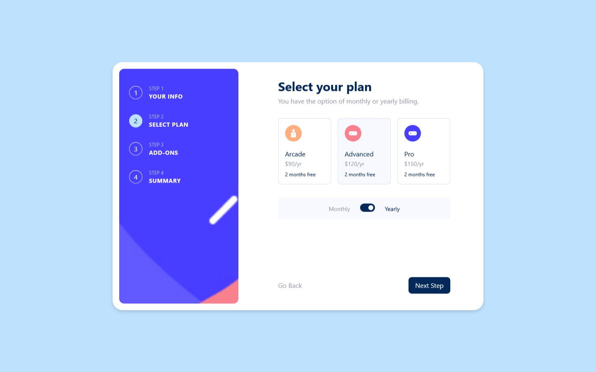

**Live Demo:** [multi-step-form-theta-sooty.vercel.app](https://multi-step-form-theta-sooty.vercel.app)

---

## Overview

Multi-step Form is a Frontend Mentor challenge solution that walks users through a subscription flow across four steps — personal info, plan selection, add-ons, and summary — before reaching a confirmation screen. Form state persists to local storage on submit, validation prevents skipping steps, and each step is directly linkable via the sidebar.

---

## Features

- Four-step subscription form (info, plan, add-ons, summary)
- Sidebar navigation with links to each step
- Inline validation that prevents skipping incomplete steps
- Form data saved to local storage on submit
- Formatted add-on names on the summary step
- Fully responsive across mobile, tablet, and desktop

---

## Tech Stack

| Category | Technology |
|---|---|
| Framework | React + Vite |
| Language | TypeScript |
| Styling | Tailwind CSS |
| Routing | React Router |
| Forms | React Hook Form + Zod |
| UI Components | Radix UI |
| State Management | Zustand |

---

## Getting Started

### Prerequisites

- Node.js `v18+`

### Installation

```bash
git clone https://github.com/nofuenterr/multi-step-form.git
cd multi-step-form
npm install
```

### Running the App

```bash
npm run preview
```

### Build

```bash
npm run build
```

---

## Screenshots

<table>
  <tr>
    <th colspan="3">Personal Info</th>
  </tr>
  <tr>
    <th>Desktop</th>
    <th>Tablet</th>
    <th>Mobile</th>
  </tr>
  <tr>
    <td>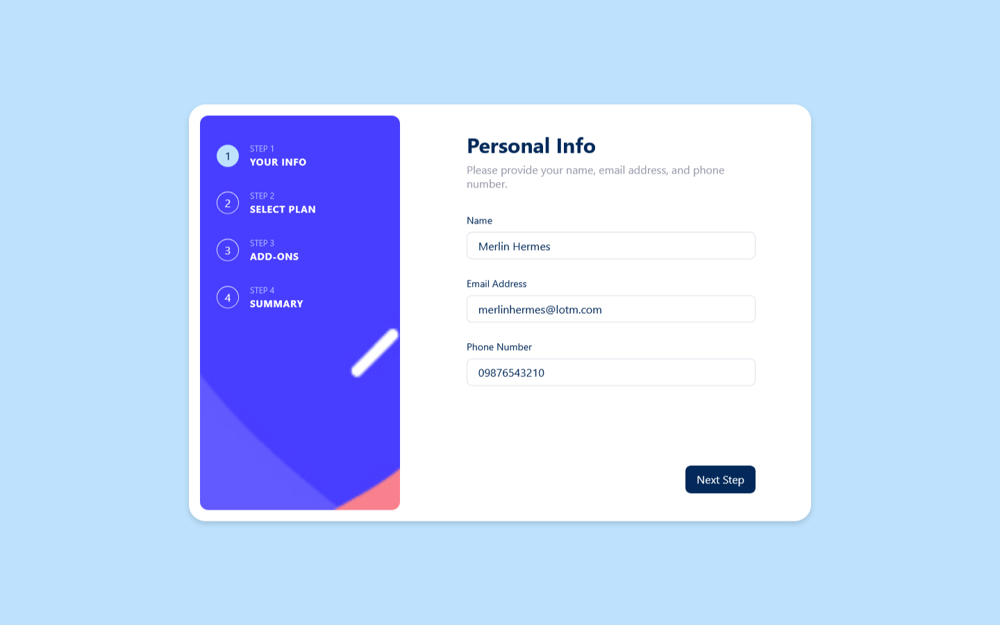</td>
    <td></td>
    <td>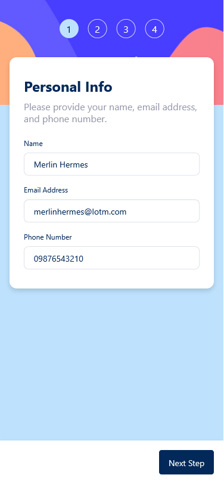</td>
  </tr>
</table>

<table>
  <tr>
    <th colspan="3">Plan</th>
  </tr>
  <tr>
    <th>Desktop</th>
    <th>Tablet</th>
    <th>Mobile</th>
  </tr>
  <tr>
    <td></td>
    <td>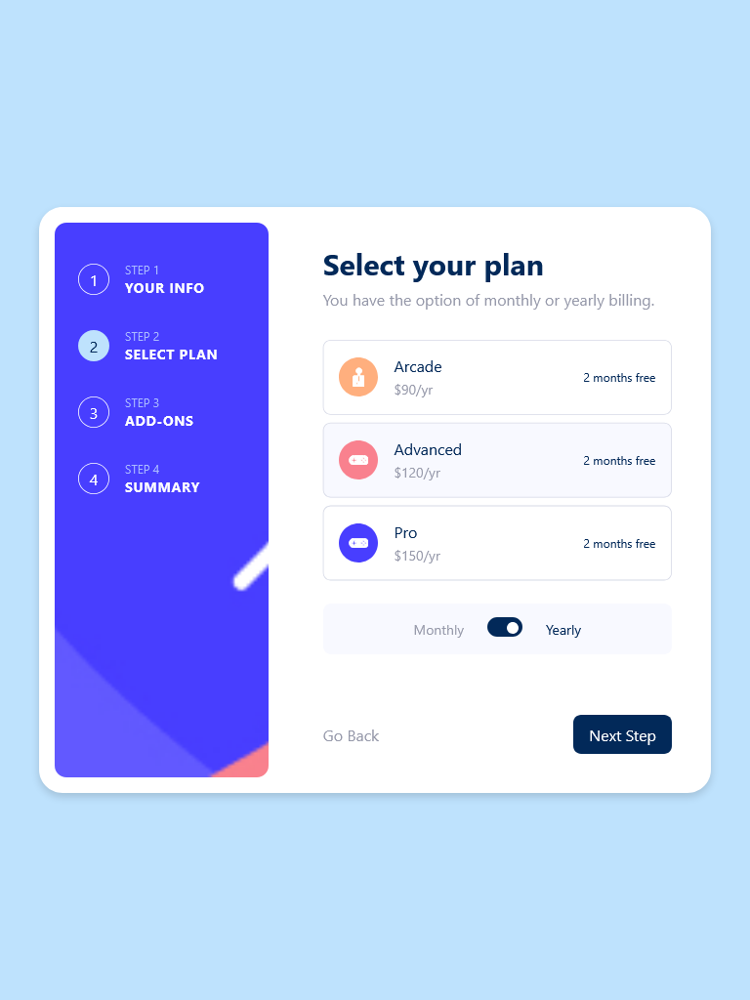</td>
    <td>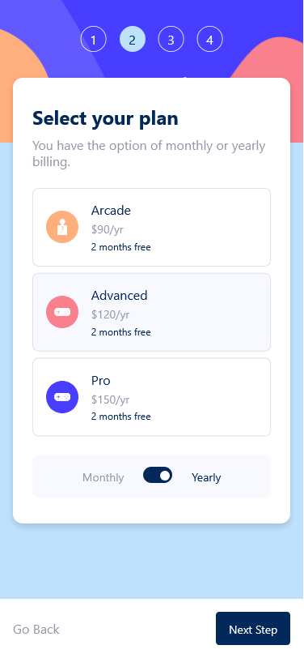</td>
  </tr>
</table>

<table>
  <tr>
    <th colspan="3">Addons</th>
  </tr>
  <tr>
    <th>Desktop</th>
    <th>Tablet</th>
    <th>Mobile</th>
  </tr>
  <tr>
    <td>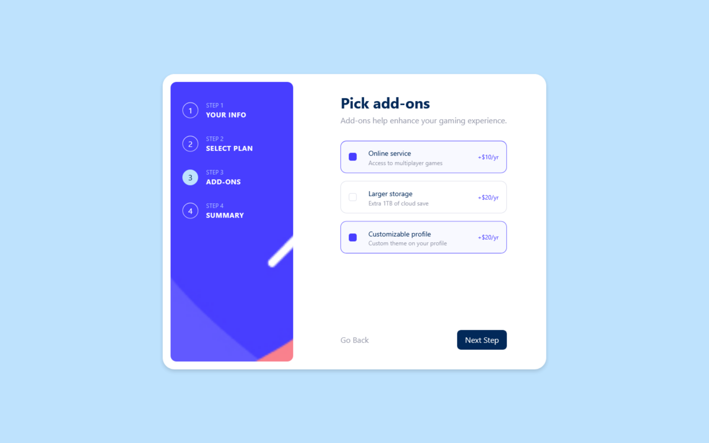</td>
    <td>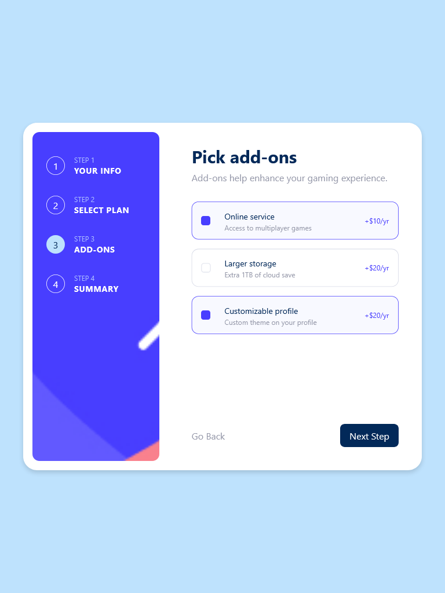</td>
    <td>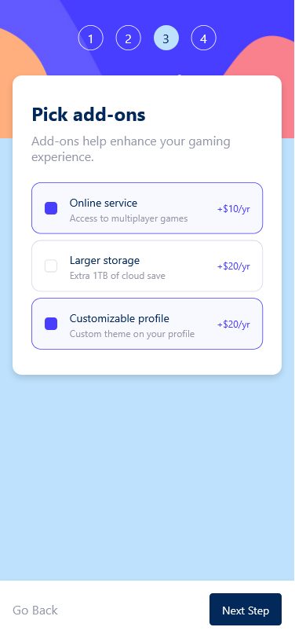</td>
  </tr>
</table>

<table>
  <tr>
    <th colspan="3">Summary</th>
  </tr>
  <tr>
    <th>Desktop</th>
    <th>Tablet</th>
    <th>Mobile</th>
  </tr>
  <tr>
    <td>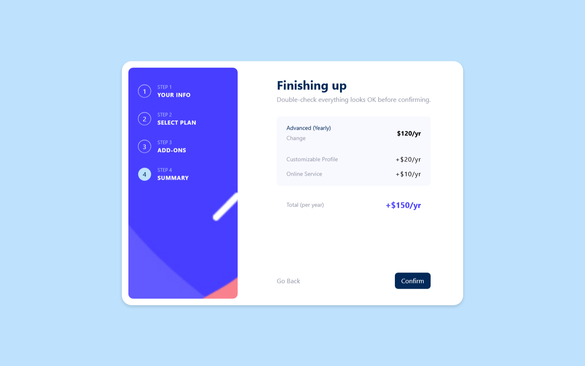</td>
    <td>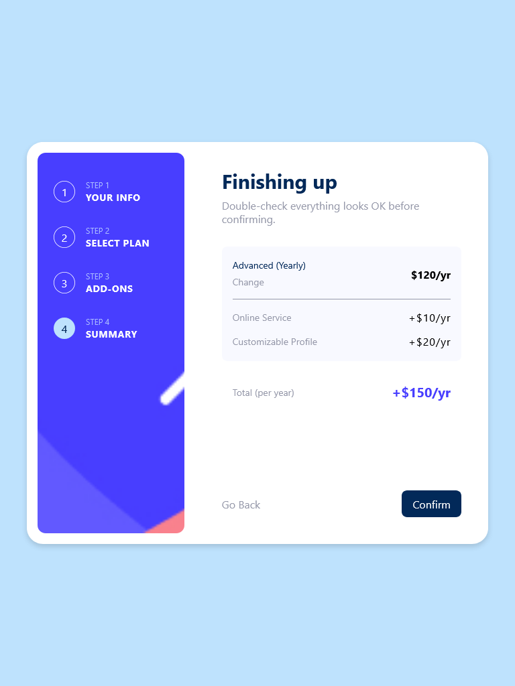</td>
    <td>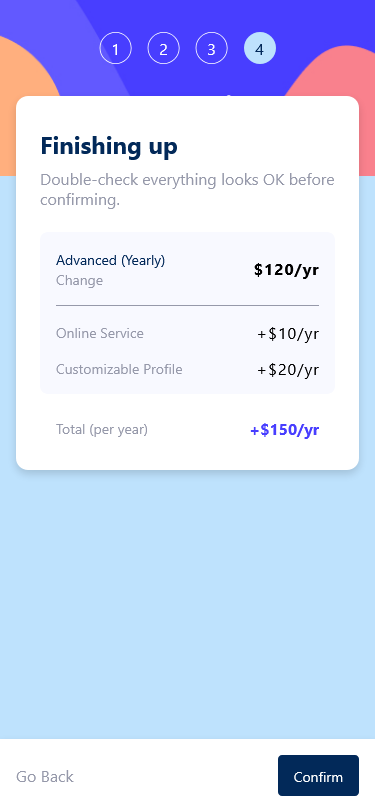</td>
  </tr>
</table>

---

## To-do

### In Progress / Upcoming

- [ ] Animations and step transitions
- [ ] Checkbox icon on Add-ons step
- [ ] Persist form data on change (survive page reload mid-form)
- [ ] Improve error handling
- [ ] Dark mode toggle

### Completed

- [x] Formatted add-on names on the Summary step

---

## Credits

This project is a solution to a [Frontend Mentor](https://www.frontendmentor.io) challenge. I do not own the rights to any assets used.

---

*Developed by **RR Nofuente***